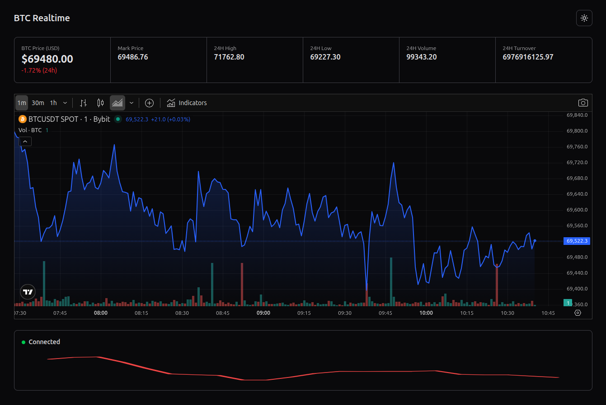

<h1 align="center">Real-Time Bitcoin (BTC/USDT) Dashboard</h1>

A real-time Bitcoin dashboard built using Next.js, WebSockets, and TradingView.

<h2>Overview</h2>

This project implements a real-time Bitcoin (BTC/USDT) dashboard using the ByBit WebSocket API.
The application streams live market data and displays it through a responsive interface with light
and dark theme support.

<h2>Application Preview</h2>

<h2>Features</h2>

<h3>Real-Time Market Data</h3>
<ul>
<li>Live BTC/USDT price updates using the ByBit WebSocket API</li>
<li>Displays the following metrics:</li>
<ul>
<li>Last traded price</li>
<li>Mark price</li>
<li>24h high</li>
<li>24h low</li>
<li>24h turnover</li>
<li>24h percent change</li>
</ul>
</ul>

<h3>Dynamic Price Indicators</h3>
<ul>
<li>Price increase highlighted in green</li>
<li>Price decrease highlighted in red</li>
</ul>

<h3>TradingView Chart Integration</h3>
<ul>
<li>Embedded TradingView Advanced Chart widget</li>
<li>Displays BTC/USDT market data</li>
<li>Supports both light and dark themes</li>
</ul>

<h3>Light and Dark Mode</h3>
<ul>
<li>Theme toggle implemented</li>
<li>Theme applied across the entire dashboard including chart and UI components</li>
</ul>

<h3>Additional Features</h3>
<ul>
<li>Sparkline chart showing the last 60 seconds of BTC price movement</li>
<li>WebSocket connection status indicator</li>
<li>Automatic reconnection when the WebSocket connection drops</li>
</ul>

<h2>Technology Stack</h2>

<ul>
<li>Next.js (App Router)</li>
<li>React</li>
<li>TypeScript</li>
<li>ByBit WebSocket API</li>
<li>TradingView Advanced Chart Widget</li>
<li>Tailwind CSS</li>
</ul>

<h2>WebSocket Integration</h2>

WebSocket Endpoint:

<pre>
wss://stream.bybit.com/v5/public/linear
</pre>

Subscription Topic:

<pre>
tickers.BTCUSDT
</pre>

The application listens for snapshot and delta messages to maintain an updated state of the BTC ticker data.

<h2>Project Structure</h2>

<pre>
app/
 ├─ favicon.ico
 ├─ globals.css
 ├─ layout.tsx
 └─ page.tsx

components/
 ├─ BTCHeaderStats.tsx
 ├─ BTCStatCard.tsx
 ├─ BTCSparkline.tsx
 ├─ ConnectionStatus.tsx
 ├─ TradingViewChart.tsx
 ├─ ThemeProvider.tsx
 └─ ThemeToggle.tsx

hooks/
 └─ useBTCWebSocket.ts

types/
 └─ btc.ts
</pre>

<h2>Performance and Code Quality</h2>

<ul>
<li>Clean component-based architecture</li>
<li>Reusable UI components</li>
<li>TypeScript type safety</li>
<li>WebSocket reconnection handling</li>
<li>Error handling for incoming messages</li>
<li>Optimized state updates</li>
</ul>

<h2>Responsive Design</h2>

The dashboard follows a mobile-first approach and is responsive across different screen sizes:

<ul>
<li>Mobile</li>
<li>Tablet</li>
<li>Desktop</li>
</ul>

<h2>Installation</h2>

Clone the repository:

<pre>
git clone https://github.com/tanushree-coder-girl/btc-realtime-dashboard-
</pre>

Install dependencies:

<pre>
npm install
</pre>

Run the development server:

<pre>
npm run dev
</pre>

Open the application:

<pre>
http://localhost:3000
</pre>

<h2>Estimated Time Spent</h2>

Approximately 6–8 hours were spent on implementing the dashboard including WebSocket integration,
UI development, TradingView chart integration, theme support, and additional features.

<h2>Notes</h2>

This project was developed as part of a technical assignment and follows the specified requirements
including real-time WebSocket data streaming, dynamic UI updates, TradingView chart integration,
theme support, and additional features such as sparkline visualization and connection monitoring.

